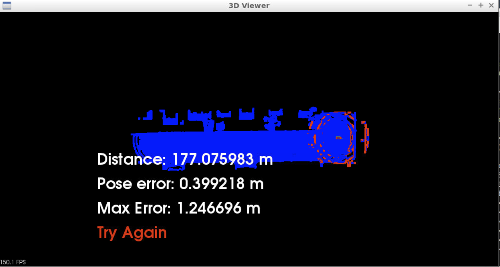
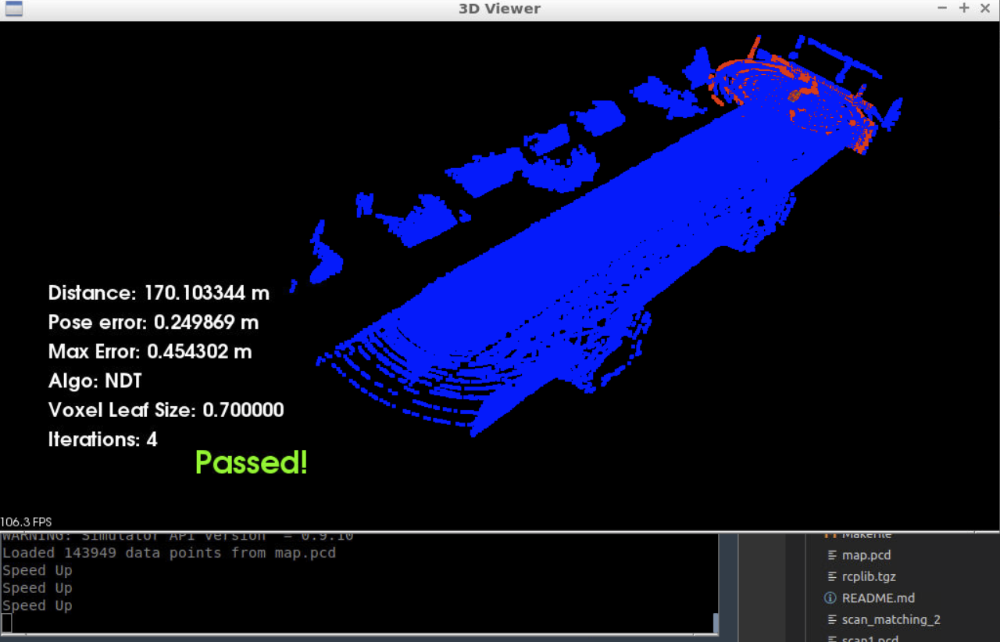
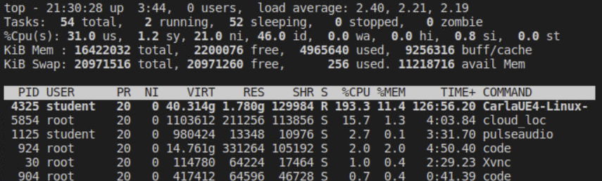
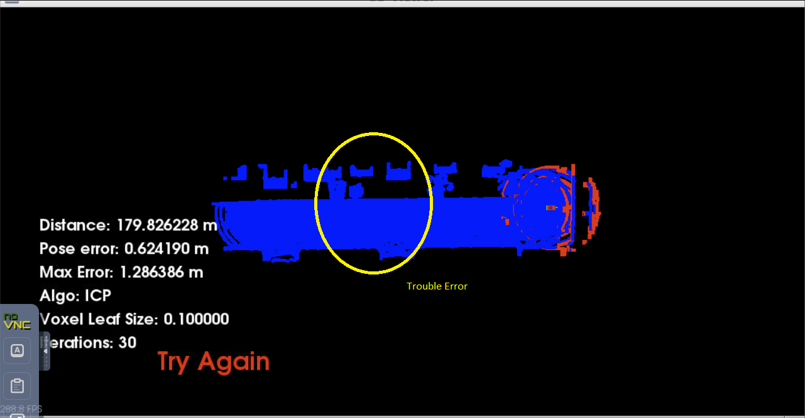

Intro
=====

This is the 3rd major course for The Udacity self driving car. This section focused on using a lidar to localize the location of car based on lidar scan given a known map.

The final project gave us two options. We can use **Iterative closest Point** (https://en.wikipedia.org/wiki/Iterative_closest_point) or NOrmal Distributions Transforms (NDT) (https://en.wikipedia.org/wiki/Normal_distributions_transform)

Both options can give good solutions to estimate new poses based on a change in the scan and previous estiamted poses.

In the final project the objective was to come up with parameters to optimize one of these algorithms to meet the time performance and accuray performance requirments.

The NDT and ICP algorithms were both explored during the course. For the final project the Point Cloud Library (PCL) versions will be used.

Given both ICP and NDT were solved during the course using the library removed a source of error out from the final testing.

Another technique to mention here as it is one of the adjustable parameters is how to reduce the number of points each algorthm will see. This is done by group points into cubes and only matching cubes. The values in the cube relates to the number of points that fall into the cube giving stronger returns. The primary parameter I will use below is the "leaf" parameter that adjusts the size of the cubes.

How to Run
----------
The application mostly follows the usage given by course.

Configure
.. code-block:: shell

    cmake .

Compile
.. code-block:: shell

    make

Run Simulator
.. code-block:: shell

    #optional depending on env but can not run as root without modifing code
    su - student
    ./run_carla.sh

After the simulator is running and the code is built an executable name `cloud_loc` is created.
Running it without paremters pick the "defaults"

Running with the the following sytnax allows paramters to change. The CLI parser is very crude and will not tolerate deviation.

.. code-block:: shell

    ./cloud_loc <algo> <iterations> <leaf size>

Where
* **<algo>** is either 'ndt' or 'icp"
* **<iterations>** is an integer for number of iterations to run algo
* **<leaf size>** is a floating point value for leaf size

Adding this simnple CLI allowed much faster attempts on values.

----------

One of my first attempts to solve the problem was using ICP. This resulted in an error of 1.24 which was very close.

This used ICP with 5 iterations and a leaf size of 1.0.

Several further attempts followed. It was hard to be patient enough at times due to the simulation appearing to be very slow. Increasing the speed about 5-6 ticks caused error to quickly exceed 1.2 meters. Even if it only ever reached 1.3 meters that still would be failing.

Some high speeds or extereme paramers would also lose all tracking and no further pose tracking would occur.

I found a good set of parameters uing NCP with a leaf size of 0.7 and 4 iterations. The resulted in a very low error and seemed to meet the requirments for the project.

In the image I also inlcuded the shell output showing my debug statments for tracking key presses. As shown this was taken at speed 3.

One issue appeared to be the speed of the simulator. It appeared the simulator required more resources than the VMs really could provide.

One snapshop (which was fairly consistent) is the simulator took up 2 total CPUs. But most of the time my algorthims were using <15% of a CPU.

Snaptop of CPU usage. When running ICP the CPU usage was higher in the matching app than using NDT.

I never found a totally successful ICP image after burning around 2 hours of GPU. The following figure annoates an area of the map that ICP seemed to struggle with. Quite often when entering this zone the pose error would exceed 1.2 briefly then quickly fall back down to errors of <0.5 meters. As seen in the image below the final pose error was 0.399 meters at 177 meters.

